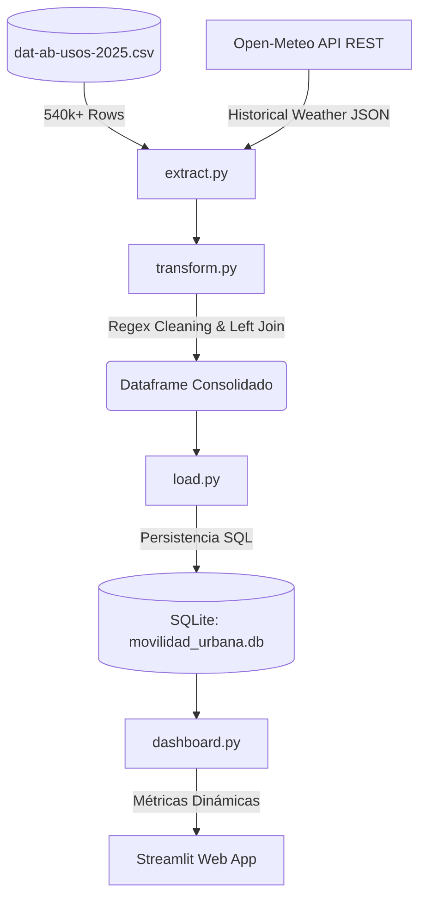

# Observatorio Analítico de Movilidad Urbana (ETL & BI)


Un pipeline analítico de extremo a extremo (End-to-End) diseñado con estándares de **Ingeniería de Datos** y **Business Intelligence** para procesar, limpiar y analizar el flujo masivo del transporte público en Argentina y su correlación meteorológica.

## Problema de negocio y aplicación corporativa

A nivel empresarial y estatal (especialmente en industrias como **Transporte, Logística, Smart Cities y Políticas Públicas**), este desarrollo resuelve problemas críticos de toma de decisiones basadas en datos masivos:

### 1. El contexto y origen de los datos
Para reflejar los retos del mundo real, este proyecto utiliza datos oficiales del **Sistema Único de Boleto Electrónico (SUBE)**. Estos datos en bruto (crudos) presentan los clásicos problemas de la recolección masiva corporativa: inconsistencias de *encoding*, valores nulos por caídas de sistema, y errores de tipeo geográficos. Además, se cruzan con datos históricos climáticos reales obtenidos asincrónicamente de la API de **Open-Meteo**.

### 2. La solución (cómo el pipeline resuelve el reto)
*   **Integración de fuentes dispares**: Consolida telemetría transaccional (viajes pagados) y condiciones meteorológicas (temperatura y precipitaciones) en un único Data Warehouse.
*   **Garantía de calidad (Data Quality & GIGO)**: En lugar de descartar filas incompletas o corruptas (lo cual alteraría el volumen nacional real de pasajeros), el pipeline emplea técnicas de **limpieza defensiva**: utiliza Expresiones Regulares (Regex) complejas para reasignar y homologar jurisdicciones faltantes (ej: mapeando algorítmicamente los errores y omisiones del Subte directamente a la jurisdicción de CABA).
*   **Decisiones basadas en evidencia (Resiliencia Climática)**: El sistema cuenta con algoritmos estadísticos que calculan la resiliencia del transporte público ante variables exógenas. Permite a un ente gubernamental o empresa concesionaria medir exactamente cómo el clima extremo (lluvias o calor >30°C) impacta en la facturación y el flujo de la demanda.
*   **Democratización del dato (BI)**: Finalmente, inyecta los datos refinados en una base relacional (SQLite) y los expone mediante un **Dashboard interactivo**. Esto permite que stakeholders no-técnicos (Gerentes de Operaciones, Intendentes, Analistas) consuman los insights de forma visual y segmentada (por provincia o municipio) en tiempo real.

## Arquitectura del proyecto

El flujo se divide en fases orquestadas modularmente, separando la lógica funcional de procesamiento (`main.py`) de la herramienta analítica de visualización (`dashboard.py`).



## Tecnologías y complejidad
- **Eficiencia espacial/temporal**: Todo el pipeline fue diseñado utilizando operaciones vectorizadas (`pandas`, `numpy`) para procesar medio millón de registros con una complejidad **O(1)** a nivel iterador, evitando los costosos cuellos de botella de los bucles `for` tradicionales.
- **Estructura modular orientada a objetos (POO)**: Implementación de *Separation of Concerns* (SoC) mediante clases independientes (`DataExtractor`, `DataTransformer`, `DataLoader`) para garantizar mantenibilidad.
- **Sistema Reactivo y Caché**: El frontend renderiza los cálculos agregados (medias móviles, market-share) en milisegundos gracias al uso de decoradores `@st.cache_data`, reteniendo estructuras en memoria RAM y reduciendo drásticamente la latencia de consultas (queries) repetitivas hacia la base de datos.

## Estructura del repositorio

```text
.
├── extract.py            # Fase 1: Extracción CSV y consumo asíncrono de API REST
├── transform.py          # Fase 2: Limpieza (Encoding, Nulls) y Data Merging
├── load.py               # Fase 3: Ingesta relacional en Data Warehouse (SQLite)
├── main.py               # Orquestador Principal (ETL central)
├── dashboard.py          # Fase 4: Despliegue de Business Intelligence (Streamlit)
├── Dockerfile            # Configuración para contenerización Cloud-ready
├── .dockerignore         # Ignora archivos pesados y cachés temporales
├── requirements.txt      # Manifiesto de dependencias Python
└── README.md
```

## Cómo ejecutar el proyecto

Existen dos formas de desplegar el proyecto: usando contenedores (recomendado para entornos de producción/evaluación) o mediante instalación local clásica.

### Opción A: Despliegue universal con Docker (Recomendado) 
Este método garantiza reproducibilidad absoluta, encapsulando dependencias y el sistema operativo subyacente. Requiere [Docker](https://www.docker.com/) instalado.

1. **Construir la imagen del ecosistema**:
```bash
docker build -t observatorio-transporte .
```

2. **Levantar el contenedor y la aplicación web**:
```bash
docker run -p 8501:8501 observatorio-transporte
```
*Abre `http://localhost:8501` en tu navegador web para comenzar a explorar.*

---

### Opción B: Instalación local tradicional (Desarrollo)

1. **Instalación y entorno virtual**
Crea un entorno y carga las dependencias formales:
```bash
python -m venv venv
.\venv\Scripts\activate   # En Windows
pip install -r requirements.txt
```

### 2. Ejecución del pipeline ETL (Data Engineering)
Asegurándote de tener el CSV oficial en la raíz de la carpeta, ejecuta el orquestador:
```bash
python main.py
```
> *Esto leerá los datos sucios en bruto, descargará 365 días de clima histórico vía API remota, los fusionará, resolverá los errores de completitud y exportará todo a la base transaccional (movilidad_urbana.db).*

### 3. Lanzar el Dashboard Analítico (BI)
Para visualizar los insights extraídos:
```bash
streamlit run dashboard.py
```

---
<p align="center" style="font-size: 12px; color: gray;">
  Desarrollado por <a href="https://github.com/tobidelos" target="_blank" style="font-weight: bold; color: #6366f1;">ttobidelos</a>
</p>

